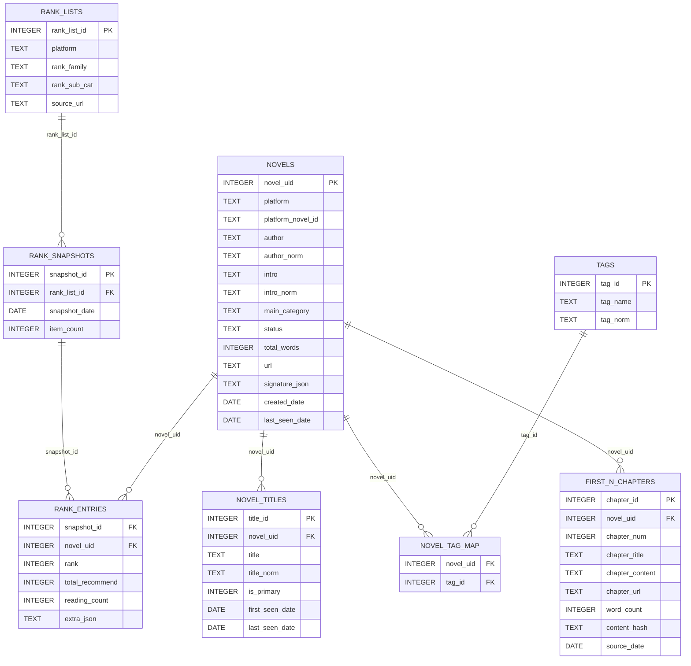

# WebNovel Trends - 小说热点分析系统
（非商业用途，仅供学习以及个人使用）

## 1. Project Planning
### 1.1 Phase 1：
 - 使用Selenium每日自动爬取起点中文网、番茄小说榜单数据，包含榜单中每本作品的书名，作者，简介，分类（如“仙侠·修真文明”或者“科幻末世”）开篇N章（可调节）
 - 自动化生成每日，每月以及每季度的热点题材分布报告以及可视化数据
 - 目标：给用户（作者）提供网络小说市场趋势参考，以便用户（作者）选择最容易获得流量的题材

### 1.2 Phase 2：
 - 使用RAG和Agent Skills等技术，面向“设定/人物卡/事件线（大纲）/时间线/地点线”等小说的metadata，以及前文K个章节建立资料库
 - 使用API接入可选LLM（如ChatGPT，DeepSeek，Gemini）来比较不同模型的生成结果并且让用户选择，并提供已有大模型的可选参数（如entropy or role in API)
 - 目标：在长篇小说文本生成任务中前后文信息保持一致

### 1.3 Phase 3：
 - 使用 a) 热点题材小说的开篇N个章节; b) 用户（作者）自选的小说内容 作为训练用材料，fine-tune 本地小型LLM，生成LoRA来模仿写作风格
 - 总结以上所说a) ，b) 的写作风格数据（如平均句子长度），提取故事大纲，人物塑造
 - 将fine-tune好的本地小模型与大模型（如ChatGPT，DeepSeek，Gemini）结合生成质量更高的长篇小说文本

---

## 2. Structure
### 2.1 Project Directory Structure
```text
webnovel_trends/
├── analysis/
│   ├── trend_analyzer.py    # 趋势分析器
│   └── visualizer.py        # 可视化模块
├── database/
│   └── db_schema.py         # 数据库schema设置
│   └── db_handler.py        # 数据库交互操作
├── tasks/
│   └── scheduler.py         # 任务调度器
├── spiders/
│   ├── base_spider.py       # 爬虫基类
│   ├── qidian_spider.py     # 起点爬虫
│   ├── fanqie_spider.py     # 番茄爬虫
│   ├── fanqie_font_decoder  # 番茄解码
│   ├── request_handler      # Selenium 请求
├── outputs/
│   ├── logs/                # 日志文件
│   ├── data/                # 数据存储
│   └── reports/             # 分析报告
├── tests/                   # 测试
│   ├── qidian_test.py       # 起点爬虫测试
│   ├── fanqie_test.py       # 番茄爬虫测试
├── config.py                # 配置文件
├── requirements.txt         # 依赖列表
├── main.py                  # 主程序入口
└── README.md                # 项目说明
```

### 2.2 Database Structure (ER-Diagram)


#### 2.2.1 [详细数据库信息](DB_Doc.md)

---


## 3. 快捷方式
### 3.1. 安装依赖
```bash
pip install -r requirements.txt
```
### 3.2. qidian_test
#### 3.2.1 快速测试（基本功能）
```bash 
python tests/qidian_test.py --test quick
```
#### 3.2.2 完整测试（所有功能）
```bash 
python tests/qidian_test.py --test all --pages 2 --top_n 5 --verbose
```
#### 3.2.3 只测试榜单抓取（前3本书，1页）
```bash
python tests/qidian_test.py --test rank_list --pages 1 --top_n 3
```
#### 3.2.4 测试完整流程（含章节抓取）
```bash
python tests/qidian_test.py --test full_pipeline --pages 1 --top_n 2 --fetch_chapters --chapter_n 2
```
#### 3.2.5 测试智能补全
```bash python
tests/qidian_test.py --test enrich --pages 1 --top_n 3 --fetch_chapters --chapter_n 5
```
#### 3.2.6 测试多个榜单
```bash
python tests/qidian_test.py --test multiple_ranks --pages 1 --top_n 2 --fetch_chapters --chapter_n 3 --rank_keys "hotsales,yuepiao,recom,collect"
```
### 3.3. fanqie_test
#### 3.3.1 快速测试（基本功能）
```bash
python tests/fanqie_test.py --test quick
```
#### 3.3.2 完整测试（所有功能）
```bash
python tests/fanqie_test.py --test all --pages 2 --limit_books 10 --top_n 5 --chapter_n 3
```
#### 3.3.3 测试完整流程（含章节抓取）
```bash
python tests/fanqie_test.py --test rank_pipeline --pages 1 --limit_books 3 --top_n 2 --fetch_chapters --chapter_n 2
```
#### 3.3.4 测试智能补全和去重
```bash
python tests/fanqie_test.py --test all --pages 1 --limit_books 3 --top_n 2 --fetch_chapters --chapter_n 5 --rank_key read_western_fantasy
```
#### 3.3.5 测试多个榜单
```bash
python tests/fanqie_test.py --test quick --rank_keys "read_western_fantasy,read_scifi_apocalypse,new_urban_highmartial"
```
## 4. 额外信息
### 4.1 起点榜单信息
```text
新书榜说明
新书榜有四个，分别为：签约作者新书榜、公众作者新书榜、新人签约新书榜、新人作者新书榜。 以上榜单不会同时收录同一部作品。
1） 签约作者新书榜收录标准：阅文自有原创作品，作者在阅文已有一部以及以上签约作品（不包含当前作品），总字数低于20万字、签约完成30天内、近三天内更新过一次，作品未入V。
2） 公众作者新书榜收录标准：作者在成为阅文作家后发表两部或两部以上的非签约作品（起点、创世、云起平台签约均包括），总字数低于20万字、加入起点书库30天内、每三天内更新过一次的作品。
3） 新人签约新书榜收录标准：阅文自有原创作品，作者在阅文的第一部签约作品，总字数低于20万字，签约完成30天以内，近三天内更新过一次；作品未入V。
4） 新人作者新书榜收录标准：作者成为阅文作家后发表的第一部作品，而且是非签约作品（起点、创世、云起平台签约均包括），总字数低于20万字 、加入起点书库30天内、每三天内更新过一次的作品。

以上榜单的根据作品阅读指数排序，阅读指数是一个综合了用户阅读、互动、订阅、打赏、投票等多种行为等综合指数，能够全面等反映作品等受欢迎程度。
```
Source: https://www.qidian.com/help/index/6

### 4.2 番茄榜单信息
```text
榜单说明
作品按照其在番茄小说中的分类进行划分排榜，排榜顺序按照在读数据排序，仅排1000在读以上的作品
阅读榜：30万字以上、已签约未下架、已经开始推荐的番茄原创作品
新书榜：30万字以下、已签约未下架、已经开始推荐的且未断更，完结未超过90天的番茄原创作品

排行榜每天下午3点前更新截止到上一日的排名数据
```