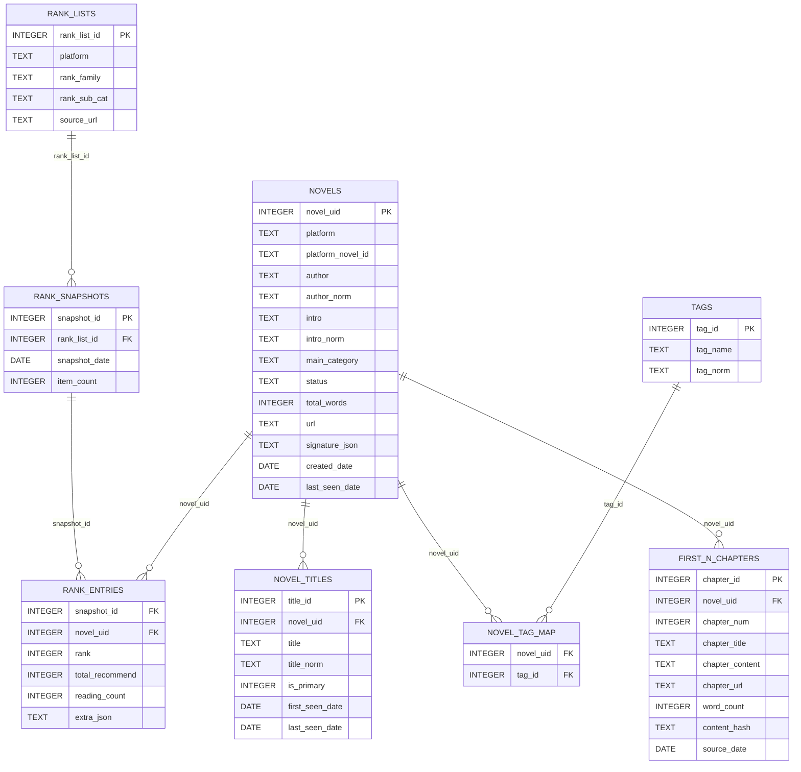

# WebNovel Trends - 小说热点分析系统
（非商业用途，仅供学习以及个人使用）

### 1. Project Planning
#### 1.1 Phase 1：
 - 使用Selenium每日自动爬取起点中文网、番茄小说榜单数据，包含榜单中每本作品的书名，作者，简介，分类（如“仙侠·修真文明”或者“科幻末世”）开篇N章（可调节）
 - 自动化生成每日，每月以及每季度的热点题材分布报告以及可视化数据
 - 目标：给用户（作者）提供网络小说市场趋势参考，以便用户（作者）选择最容易获得流量的题材

#### 1.2 Phase 2：
 - 使用RAG和Agent Skills等技术，面向“设定/人物卡/事件线（大纲）/时间线/地点线”等小说的metadata，以及前文K个章节建立资料库
 - 使用API接入可选LLM（如ChatGPT，DeepSeek，Gemini）来比较不同模型的生成结果并且让用户选择，并提供已有大模型的可选参数（如entropy or role in API)
 - 目标：在长篇小说文本生成任务中前后文信息保持一致

#### 1.3 Phase 3：
 - 使用 a) 热点题材小说的开篇N个章节; b) 用户（作者）自选的小说内容 作为训练用材料，fine-tune 本地小型LLM，生成LoRA来模仿写作风格
 - 总结以上所说a) ，b) 的写作风格数据（如平均句子长度），提取故事大纲，人物塑造
 - 将fine-tune好的本地小模型与大模型（如ChatGPT，DeepSeek，Gemini）结合生成质量更高的长篇小说文本

### 2. Structure
#### 2.1 Project Directory Structure
```text
webnovel_trends/
├── analysis/
│   ├── trend_analyzer.py    # 趋势分析器
│   └── visualizer.py        # 可视化模块
├── database/
│   └── db_schema.py         # 数据库schema设置
│   └── db_handler.py        # 数据库交互操作
├── tasks/
│   └── scheduler.py         # 任务调度器
├── spiders/
│   ├── base_spider.py       # 爬虫基类
│   ├── qidian_spider.py     # 起点爬虫
│   ├── fanqie_spider.py     # 番茄爬虫
│   ├── fanqie_font_decoder  # 番茄解码
│   ├── request_handler      # Selenium 请求
├── outputs/
│   ├── logs/                # 日志文件
│   ├── data/                # 数据存储
│   └── reports/             # 分析报告
├── tests/                   # 测试
│   ├── qidian_test.py       # 起点爬虫测试
│   ├── fanqie_test.py       # 番茄爬虫测试
├── config.py                # 配置文件
├── requirements.txt         # 依赖列表
├── main.py                  # 主程序入口
└── README.md                # 项目说明
```

#### 2.2 Database Structure (ER-Diagram)

##### 各table详细解释
 ## 📘 数据库表结构说明（Phase 1）

---

- novels：小说主表，存储唯一版本的小说，同时存储小说的核心 metadata

`novels` 是整个数据库的核心表，每一行代表一部小说（在单一平台上的唯一版本），用于统一承载小说的基础信息，并作为其它表（榜单、标签、章节等）的关联锚点。

| 字段名 | 类型 | 含义 |
|------|------|------|
| novel_uid | INTEGER (PK) | 数据库内部生成的小说唯一 ID |
| platform | TEXT | 小说所属平台（qidian / fanqie） |
| platform_novel_id | TEXT | 平台内部的小说 ID |
| author | TEXT | 作者原始显示名 |
| author_norm | TEXT | 归一化后的作者名（用于匹配/索引） |
| intro | TEXT | 小说简介原文 |
| intro_norm | TEXT | 归一化后的简介文本（用于相似度计算） |
| main_category | TEXT | 小说主分类（如：科幻 / 都市 / 玄幻） |
| status | TEXT | 小说状态（ongoing / completed） |
| total_words | INTEGER | 当前小说总字数 |
| url | TEXT | 小说详情页链接 |
| signature_json | TEXT | 用于同书判别的特征签名（JSON） |
| created_date | DATE | 小说首次进入数据库的日期 |
| last_seen_date | DATE | 最近一次在抓取数据中出现的日期 |

---

- novel_titles：小说书名历史表，记录同一小说的多个书名（改名 / 别名）

`novel_titles` 用于解决“小说会改名”的问题，完整保留一部小说在不同时间点出现过的所有书名。

| 字段名 | 类型 | 含义 |
|------|------|------|
| title_id | INTEGER (PK) | 书名记录 ID |
| novel_uid | INTEGER (FK) | 关联的小说 ID |
| title | TEXT | 小说书名原文 |
| title_norm | TEXT | 归一化后的书名 |
| is_primary | INTEGER | 是否为当前主书名（1 是，0 否） |
| first_seen_date | DATE | 该书名首次出现日期 |
| last_seen_date | DATE | 该书名最近出现日期 |

---

- tags：题材标签字典表，存储去重后的细分题材标签

`tags` 是全局的题材标签字典，统一存储番茄小说的标签与起点小说的副分类，用于细粒度题材分析。

| 字段名 | 类型 | 含义 |
|------|------|------|
| tag_id | INTEGER (PK) | 标签 ID |
| tag_name | TEXT | 标签原始名称 |
| tag_norm | TEXT | 归一化后的标签名称（唯一） |

---

- novel_tag_map：小说-标签映射表，表示小说与题材标签的多对多关系

`novel_tag_map` 用于将小说与多个细分题材标签关联，是进行题材热度与分布分析的关键中间表。

| 字段名 | 类型 | 含义 |
|------|------|------|
| novel_uid | INTEGER (FK) | 小说 ID |
| tag_id | INTEGER (FK) | 标签 ID |

---

- rank_lists：榜单定义表，描述“榜单是什么”

`rank_lists` 定义榜单的身份信息，用于统一描述起点与番茄的不同榜单类型，而不包含具体排名数据。

| 字段名 | 类型 | 含义 |
|------|------|------|
| rank_list_id | INTEGER (PK) | 榜单定义 ID |
| platform | TEXT | 平台（qidian / fanqie） |
| rank_family | TEXT | 榜单大类（阅读榜 / 新书榜 / 畅销榜等） |
| rank_sub_cat | TEXT | 起点新书榜的四个子类（其它榜单为空） |
| source_url | TEXT | 榜单入口页面 URL |

---

- rank_snapshots：榜单每日快照表，表示榜单在某一天的整体状态

`rank_snapshots` 用于记录某个榜单在某一天的完整排名快照，是榜单时间序列分析的基础。

| 字段名 | 类型 | 含义 |
|------|------|------|
| snapshot_id | INTEGER (PK) | 榜单快照 ID |
| rank_list_id | INTEGER (FK) | 所属榜单定义 |
| snapshot_date | DATE | 数据归属日期 |
| item_count | INTEGER | 当天榜单收录的小说数量 |

---

- rank_entries：榜单条目表，存储具体的小说排名与指标数据

`rank_entries` 是核心事实表，记录某一天某榜单中每部小说的排名及对应的平台指标。

| 字段名 | 类型 | 含义 |
|------|------|------|
| snapshot_id | INTEGER (FK) | 所属榜单快照 |
| novel_uid | INTEGER (FK) | 小说 ID |
| rank | INTEGER | 小说在榜单中的排名 |
| total_recommend | INTEGER | 起点小说的总推荐数（仅起点使用） |
| reading_count | INTEGER | 番茄小说的在读人数（仅番茄使用） |
| extra_json | TEXT | 其它可扩展的榜单指标（JSON） |

---

- first_n_chapters：开篇章节表，存储小说前 N 章内容

`first_n_chapters` 用于存储小说的开篇章节内容，为分析热门小说的开篇结构与写作风格提供原始文本数据。

| 字段名             | 类型 | 含义              |
|-----------------|------|-----------------|
| chapter_id      | INTEGER (PK) | 章节 ID           |
| novel_uid       | INTEGER (FK) | 所属小说 ID         |
| chapter_num     | INTEGER | 章节序号            |
| chapter_title   | TEXT | 章节标题            |
| chapter_content | TEXT | 章节正文内容          |
| chapter_url     | TEXT | 章节页面链接          |
| word_count      | INTEGER | 章节字数            |
| content_hash    | TEXT | 内容指纹（用于去重/更新判断） |
| publish_date    | DATE | 章节发布日期          |

---


### 3. 快捷方式
#### 1. 安装依赖
```bash
pip install -r requirements.txt
```
#### 2. qidian_test
##### 快速测试（基本功能）
python tests/qidian_test.py --test quick

##### 完整测试（所有功能）
python tests/qidian_test.py --test all --pages 2 --top_n 5 --verbose

##### 只测试榜单抓取（前3本书，1页）
python tests/qidian_test.py --test rank_list --pages 1 --top_n 3

##### 测试完整流程（含章节抓取）
python tests/qidian_test.py --test full_pipeline --pages 1 --top_n 2 --fetch_chapters --chapter_n 2

##### 测试智能补全
python tests/qidian_test.py --test enrich --pages 1 --top_n 3 --fetch_chapters --chapter_n 5

#### 3. fanqie_test
##### 快速测试
python tests/fanqie_test.py --test quick

##### 测试所有功能（榜单、详情、丰富数据、解密等）
python tests/fanqie_test.py --test all

##### 只测试榜单抓取
python tests/fanqie_test.py --test rank_list

##### 测试章节抓取
python tests/fanqie_test.py --test chapters --fetch_chapters --chapter_n 3