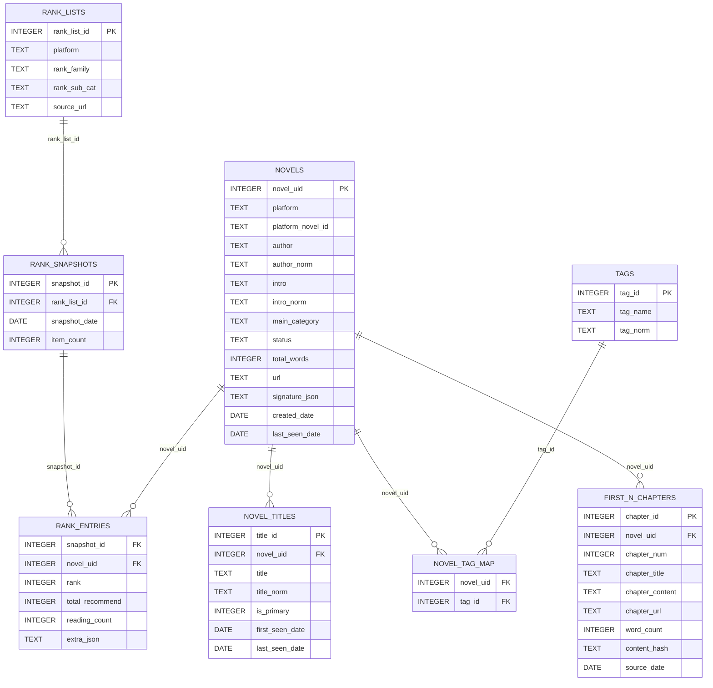

## Database Structure 
### 1. ER-Diagram

### 2. 数据库表结构说明

---

- novels：小说主表，存储唯一版本的小说，同时存储小说的核心 metadata

`novels` 是整个数据库的核心表，每一行代表一部小说（在单一平台上的唯一版本），用于统一承载小说的基础信息，并作为其它表（榜单、标签、章节等）的关联锚点。

| 字段名 | 类型 | 含义 |
|------|------|------|
| novel_uid | INTEGER (PK) | 数据库内部生成的小说唯一 ID |
| platform | TEXT | 小说所属平台（qidian / fanqie） |
| platform_novel_id | TEXT | 平台内部的小说 ID |
| author | TEXT | 作者原始显示名 |
| author_norm | TEXT | 归一化后的作者名（用于匹配/索引） |
| intro | TEXT | 小说简介原文 |
| intro_norm | TEXT | 归一化后的简介文本（用于相似度计算） |
| main_category | TEXT | 小说主分类（如：科幻 / 都市 / 玄幻） |
| status | TEXT | 小说状态（ongoing / completed） |
| total_words | INTEGER | 当前小说总字数 |
| url | TEXT | 小说详情页链接 |
| signature_json | TEXT | 用于同书判别的特征签名（JSON） |
| created_date | DATE | 小说首次进入数据库的日期 |
| last_seen_date | DATE | 最近一次在抓取数据中出现的日期 |

---

- novel_titles：小说书名历史表，记录同一小说的多个书名（改名 / 别名）

`novel_titles` 用于解决“小说会改名”的问题，完整保留一部小说在不同时间点出现过的所有书名。

| 字段名 | 类型 | 含义 |
|------|------|------|
| title_id | INTEGER (PK) | 书名记录 ID |
| novel_uid | INTEGER (FK) | 关联的小说 ID |
| title | TEXT | 小说书名原文 |
| title_norm | TEXT | 归一化后的书名 |
| is_primary | INTEGER | 是否为当前主书名（1 是，0 否） |
| first_seen_date | DATE | 该书名首次出现日期 |
| last_seen_date | DATE | 该书名最近出现日期 |

---

- tags：题材标签字典表，存储去重后的细分题材标签

`tags` 是全局的题材标签字典，统一存储番茄小说的标签与起点小说的副分类，用于细粒度题材分析。

| 字段名 | 类型 | 含义 |
|------|------|------|
| tag_id | INTEGER (PK) | 标签 ID |
| tag_name | TEXT | 标签原始名称 |
| tag_norm | TEXT | 归一化后的标签名称（唯一） |

---

- novel_tag_map：小说-标签映射表，表示小说与题材标签的多对多关系

`novel_tag_map` 用于将小说与多个细分题材标签关联，是进行题材热度与分布分析的关键中间表。

| 字段名 | 类型 | 含义 |
|------|------|------|
| novel_uid | INTEGER (FK) | 小说 ID |
| tag_id | INTEGER (FK) | 标签 ID |

---

- rank_lists：榜单定义表，描述“榜单是什么”

`rank_lists` 定义榜单的身份信息，用于统一描述起点与番茄的不同榜单类型，而不包含具体排名数据。

| 字段名 | 类型 | 含义 |
|------|------|------|
| rank_list_id | INTEGER (PK) | 榜单定义 ID |
| platform | TEXT | 平台（qidian / fanqie） |
| rank_family | TEXT | 榜单大类（阅读榜 / 新书榜 / 畅销榜等） |
| rank_sub_cat | TEXT | 起点新书榜的四个子类（其它榜单为空） |
| source_url | TEXT | 榜单入口页面 URL |

---

- rank_snapshots：榜单每日快照表，表示榜单在某一天的整体状态

`rank_snapshots` 用于记录某个榜单在某一天的完整排名快照，是榜单时间序列分析的基础。

| 字段名 | 类型 | 含义 |
|------|------|------|
| snapshot_id | INTEGER (PK) | 榜单快照 ID |
| rank_list_id | INTEGER (FK) | 所属榜单定义 |
| snapshot_date | DATE | 数据归属日期 |
| item_count | INTEGER | 当天榜单收录的小说数量 |

---

- rank_entries：榜单条目表，存储具体的小说排名与指标数据

`rank_entries` 是核心事实表，记录某一天某榜单中每部小说的排名及对应的平台指标。

| 字段名 | 类型 | 含义 |
|------|------|------|
| snapshot_id | INTEGER (FK) | 所属榜单快照 |
| novel_uid | INTEGER (FK) | 小说 ID |
| rank | INTEGER | 小说在榜单中的排名 |
| total_recommend | INTEGER | 起点小说的总推荐数（仅起点使用） |
| reading_count | INTEGER | 番茄小说的在读人数（仅番茄使用） |
| extra_json | TEXT | 其它可扩展的榜单指标（JSON） |

---

- first_n_chapters：开篇章节表，存储小说前 N 章内容

`first_n_chapters` 用于存储小说的开篇章节内容，为分析热门小说的开篇结构与写作风格提供原始文本数据。

| 字段名             | 类型 | 含义              |
|-----------------|------|-----------------|
| chapter_id      | INTEGER (PK) | 章节 ID           |
| novel_uid       | INTEGER (FK) | 所属小说 ID         |
| chapter_num     | INTEGER | 章节序号            |
| chapter_title   | TEXT | 章节标题            |
| chapter_content | TEXT | 章节正文内容          |
| chapter_url     | TEXT | 章节页面链接          |
| word_count      | INTEGER | 章节字数            |
| content_hash    | TEXT | 内容指纹（用于去重/更新判断） |
| publish_date    | DATE | 章节发布日期          |

---

### 3. 快速查询query
#### 3.1 全量检视
```text
SELECT
    t.title                                    AS title,
    n.author                                   AS author,
    n.intro                                    AS intro,
    rs.snapshot_date                           AS snapshot_date,
    rl.rank_family                             AS rank_family,
    rl.rank_sub_cat                            AS rank_sub_cat,
    re.rank                                    AS rank,
    re.total_recommend                         AS total_recommend,
    GROUP_CONCAT(DISTINCT tg.tag_name)         AS tags
FROM NOVELS AS n
JOIN NOVEL_TITLES AS t
    ON n.novel_uid = t.novel_uid
   AND t.is_primary = 1
JOIN RANK_ENTRIES AS re
    ON n.novel_uid = re.novel_uid
JOIN RANK_SNAPSHOTS AS rs
    ON re.snapshot_id = rs.snapshot_id
JOIN RANK_LISTS AS rl
    ON rs.rank_list_id = rl.rank_list_id
LEFT JOIN NOVEL_TAG_MAP AS ntm
    ON n.novel_uid = ntm.novel_uid
LEFT JOIN TAGS AS tg
    ON ntm.tag_id = tg.tag_id
WHERE n.platform = 'qidian'
GROUP BY
    t.title,
    n.author,
    n.intro,
    rs.snapshot_date,
    rl.rank_family,
    rl.rank_sub_cat,
    re.rank,
    re.total_recommend
ORDER BY
    rs.snapshot_date DESC,
    rl.rank_family ASC,
    rl.rank_sub_cat ASC,
    re.rank ASC;
```
#### 3.2 查看每个 snapshot 的完整榜单明细
```text
SELECT
    s.snapshot_id,
    s.snapshot_date,
    rl.platform,
    rl.rank_family,
    rl.rank_sub_cat,
    e.rank,
    nt.title,
    n.author
FROM rank_entries e
JOIN rank_snapshots s
    ON s.snapshot_id = e.snapshot_id
JOIN rank_lists rl
    ON rl.rank_list_id = s.rank_list_id
JOIN novels n
    ON n.novel_uid = e.novel_uid
JOIN novel_titles nt
    ON nt.novel_uid = n.novel_uid
   AND nt.is_primary = 1
ORDER BY
    s.snapshot_date,
    rl.platform,
    rl.rank_family,
    rl.rank_sub_cat,
    s.snapshot_id,
    e.rank;

```